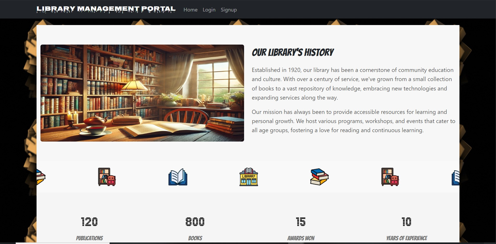
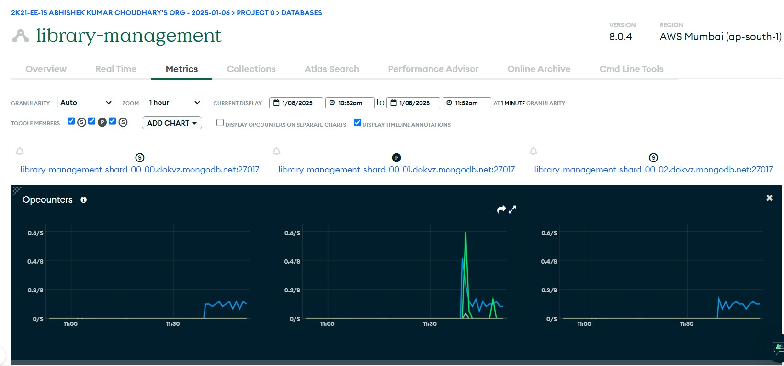
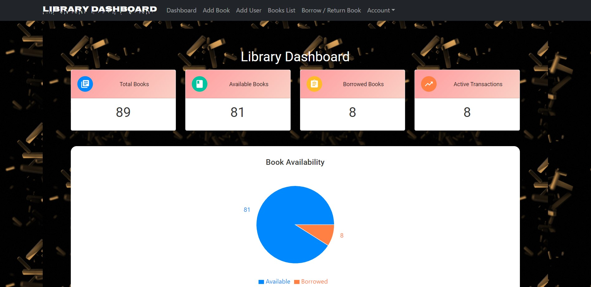
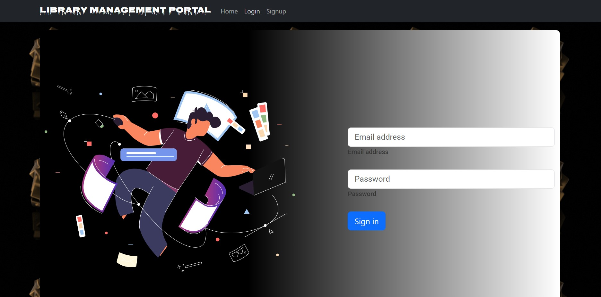
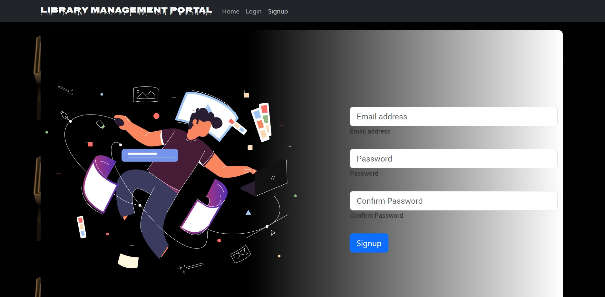

### Library Management System
---

**String Ventures Full Stack Development Assignment**

A full-stack web application to manage a library's books and users, allowing for book borrowing and returning functionalities.

---

## Table of Contents

- [About the Project](#about-the-project)
  - [Features](#features)
  - [Built With](#built-with)
- [Getting Started](#getting-started)
  - [Prerequisites](#prerequisites)
  - [Installation](#installation)
  - [Running the Application](#running-the-application)
- [Usage](#usage)
  - [Home Page](#home-page)
  - [Books Management](#books-management)
  - [Users Management](#users-management)
  - [Borrow and Return Books](#borrow-and-return-books)
  - [Dashboard](#dashboard)
- [Screenshots](#screenshots)
- [Project Structure](#project-structure)
- [API Endpoints](#api-endpoints)
- [Contact](#contact)

---

## About the Project

The **Library Management System** is a web application built using **React.js** for the frontend and **Node.js** with **Express.js** and **MongoDB** for the backend. It allows librarians and users to manage books, users, and transactions efficiently.

---

### Features

- **Books Management**
  - Add new books with details like title, author, and publication year.
  - View a list of all books with their availability status.
  - Filter books based on availability.

- **Users Management**
  - Add new users with contact information.
  - Manage user data.

- **Borrow and Return Books**
  - Borrow books for a user.
  - Return borrowed books.
  - Automatically update book availability.

- **Dashboard**
  - Visualize key library statistics.
  - Animated background for a dynamic user experience.

- **Responsive UI**
  - Modern and responsive design using Material-UI.
  - Intuitive navigation and user-friendly forms.

---

### Built With

- **Frontend**
  - [React.js](https://reactjs.org/)
  - [Material-UI](https://mui.com/)
  - [Axios](https://axios-http.com/)
  - [Recharts](https://recharts.org/)
  - [React-Tsparticles](https://github.com/matteobruni/tsparticles)

- **Backend**
  - [Node.js](https://nodejs.org/)
  - [Express.js](https://expressjs.com/)
  - [MongoDB](https://www.mongodb.com/)
  - [Mongoose](https://mongoosejs.com/)
  - [Cors](https://github.com/expressjs/cors)

---

## Getting Started

Follow these instructions to set up and run the project locally.

### Prerequisites

- **Node.js and npm** installed on your machine.
- **MongoDB** database running locally or accessible remotely.

### Installation

#### 1. Clone the Repository

```bash
git clone https://github.com/meakc/A1.git
cd A1
```

#### 2. Install Dependencies

Navigate to both the frontend and backend directories and install the dependencies.

```bash
# For the backend
cd library-backend
npm install

# For the frontend
cd ../library-frontend
npm install
```

### Running the Application

#### 1. Start the Backend Server

```bash
cd library-backend
npm start
```

#### 2. Start the Frontend Server

Open a new terminal window and navigate to the frontend directory.

```bash
cd library-frontend
npm start
```

The application should now be running on `http://localhost:3000` for the frontend and `http://localhost:5000` for the backend.

---

## Usage

### Home Page

The home page provides an overview of the library and its services.

### Books Management

Manage the library's book collection, including adding, viewing, and filtering books.

### Users Management

Manage user information and view user details.

### Borrow and Return Books

Handle book borrowing and returning transactions.

### Dashboard

Visualize key statistics about the library's operations.

---

## Screenshots

### Home Page


### Backend MongoDB

### Features


### Dashboard


### Login


### Signup


---

## Project Structure

```
library-management-system/
├── library-backend/
│   ├── models/
│   │   ├── Book.js
│   │   ├── User.js
│   │   ├── Transaction.js
│   │   └── Admin.js
│   ├── routes/
│   │   ├── books.js
│   │   ├── users.js
│   │   ├── transactions.js
│   │   ├── stats.js
│   │   └── admin.js
│   ├── .env
│   ├── app.js
│   └── ...
├── library-frontend/
│   ├── src/
│   │   ├── components/
│   │   │   ├── Home.js
│   │   │   ├── Dashboard.js
│   │   │   ├── CollectionNumbers.js
│   │   │   ├── ClientsSection.js
│   │   │   ├── CarouselBanner.js
│   │   │   └── ...
│   │   ├── image/
│   │   │   ├── home.jpg
│   │   │   ├── features.jpg
│   │   │   ├── dashboard.jpg
│   │   │   ├── login.jpg
│   │   │   └── signup.jpg
│   │   └── ...
│   ├── package.json
│   └── ...
├── README.md
└── ...
```

---

## API Endpoints

### Books

- `GET /books` - Get all books
- `POST /books` - Add a new book
- `GET /books/:id` - Get a book by ID
- `PUT /books/:id` - Update a book by ID
- `DELETE /books/:id` - Delete a book by ID

### Users

- `GET /users` - Get all users
- `POST /users` - Add a new user
- `GET /users/:id` - Get a user by ID
- `PUT /users/:id` - Update a user by ID
- `DELETE /users/:id` - Delete a user by ID

### Transactions

- `GET /transactions` - Get all transactions
- `POST /transactions` - Add a new transaction
- `GET /transactions/:id` - Get a transaction by ID
- `PUT /transactions/:id` - Update a transaction by ID
- `DELETE /transactions/:id` - Delete a transaction by ID

### Stats

- `GET /stats` - Get library statistics

### Admin

- `POST /admin/login` - Admin login

---

## Live Demo

Check out the live demo of the application [here](https://library-frontend-ljla.onrender.com/).

**Note :-  Render takes some time to live the backend after 50s of inactivity , So please wait some time !**

---
Abhishek Kumar Choudhary
